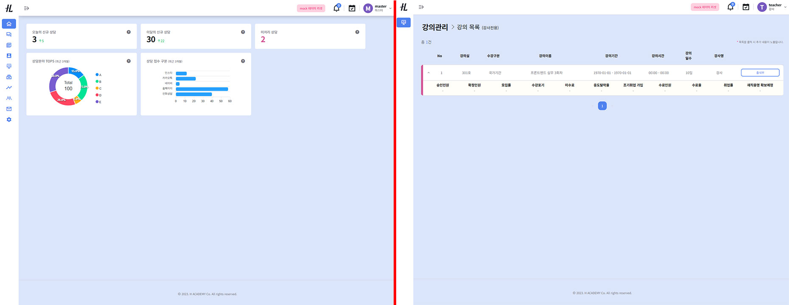
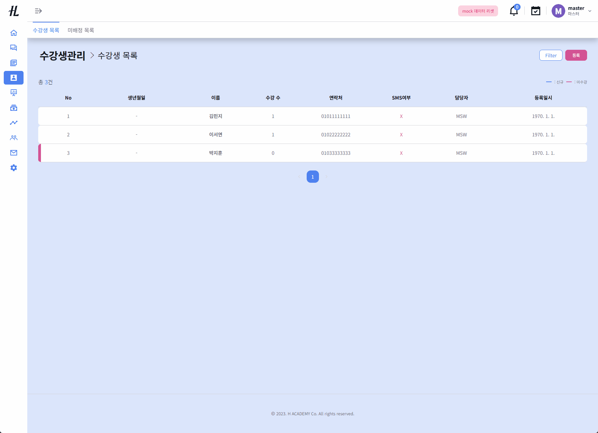
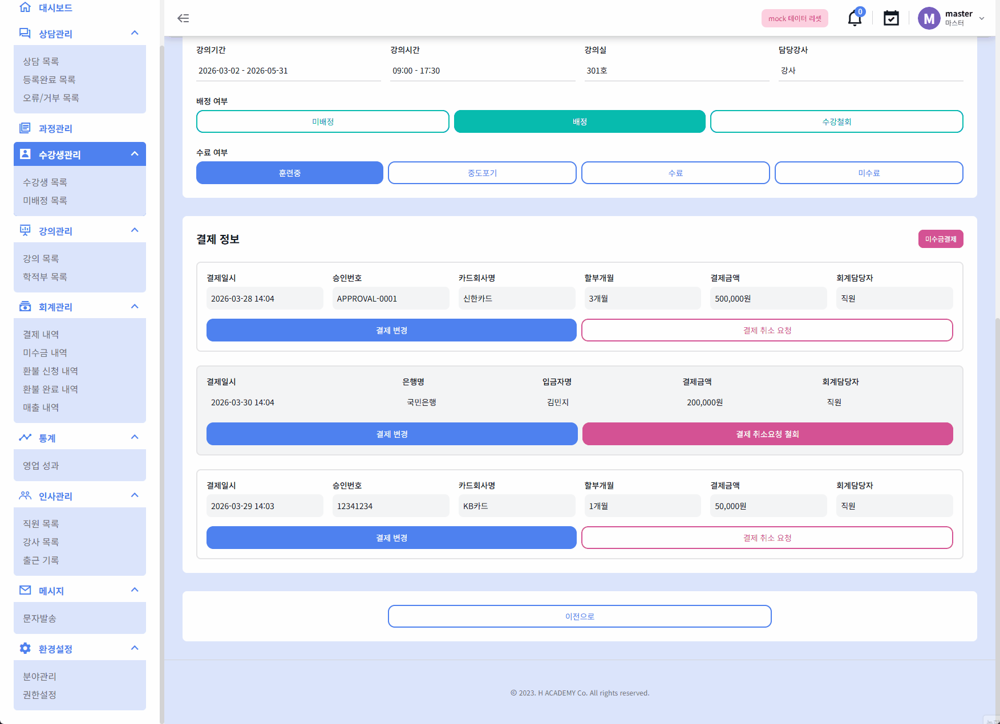

# HMS Admin Demo Portfolio

실무에서 개발한 교육 운영형 어드민 시스템(HMS)을 기반으로,
여러 도메인이 연결된 상태 기반 데이터 흐름을 중심으로 재구성한 프론트엔드 데모 프로젝트입니다.

---

## 🚀 Getting Started

### 1. 설치

```bash
npm install
```

### 2. 실행

```bash
npm run dev:admin
```

> MSW(Mock Service Worker) 기반으로 동작하며, 별도의 백엔드 없이 실행됩니다.

---

## 🔑 Test Account

### 👑 관리자 (데모 전체 흐름 확인)

- ID: `master`
- PW: `1234`

→ 전체 데이터 조회 가능
→ 주요 흐름(출석, 환불, 상태 변경 등) 시연 가능
→ 일부 기능은 데모 환경에 맞게 제한됨

---

### 👨‍🏫 강사 (권한 분기 확인)

- ID: `teacher`
- PW: `1234`

→ 본인이 담당한 강의만 조회 가능
→ 일부 기능 제한 (읽기 전용 / 버튼 비노출)
→ 권한에 따른 UI/기능 분기 확인 가능

---

## 🖥 Role-based UI Preview

권한에 따라 동일한 화면에서도 UI와 기능이 다르게 동작합니다.

```md

```

---

## 📌 Overview

복잡한 전체 기능을 모두 구현하기보다, 수강생 → 강의 → 출석 → 통계로 이어지는 **핵심 운영 흐름과 상태 변화**를 중심으로 설계했습니다.

실제 서비스에서는 상담, 수강생관리, 강의관리, 회계관리, 통계, 메시지, 환경설정 등 여러 도메인이 강하게 연결된 구조였으며, 데모에서는 이 중 **흐름이 가장 잘 드러나는 영역을 선별하여 재구성**했습니다.

---

## 🎬 Demo

### 1. 출석 상태 변경 → 출결현황 반영

- 출석 상태 변경 시 출결 통계가 함께 반영되는 구조
- 상태 변화가 다른 데이터에 연결되는 흐름 구현

```md

```

---

### 2. 배정 상태에 따른 UI 변화

- 배정 여부에 따라 수료 관련 버튼이 조건부로 노출
- 상태에 따라 UI와 기능이 분기되는 구조

```md

```

---

### 3. 환불 처리 흐름

- 환불 요청 → 승인 → 완료까지 상태 기반 처리
- 회계 데이터와 수강 상태가 함께 변경되는 구조

```md

```

---

## 🧠 Key Features

### • State-driven UI

- 상태 변화에 따라 UI와 기능이 동적으로 변화
- 특정 상태에서만 버튼 활성화 및 기능 제어

---

### • Domain-based Data Flow

- 수강생 / 강의 / 회계 데이터가 연결된 구조
- 하나의 액션이 여러 영역에 영향을 주도록 설계

예)

- 출석 상태 변경 → 출결 통계 반영
- 환불 처리 → 회계 + 수강 상태 동시 변경

---

### • Real-world Admin Flow

- list → detail → 상태 변경 → 데이터 반영 흐름 유지
- 실무 환경과 유사한 운영형 UX 구조 설계

---

## ⚙️ Tech Stack

- Next.js
- React
- TypeScript
- GraphQL (Apollo Client)
- Recoil
- styled-components / NextUI
- MSW (Mock Service Worker)

---

## 💡 Demo Strategy

> 조회 흐름은 유지하고, 변경 기능은 제한

- 핵심 흐름은 실제처럼 동작
- 일부 기능은 데모 환경에 맞게 제한
- mock 데이터 기반으로 구조 유지
- 일부 데이터는 미리 구성된 상태에서 흐름을 시연

---

## 🏗 Architecture Highlights

### • Domain Structure

수강생 → 강의 → 출석 → 통계로 이어지는 운영형 데이터 흐름 구조 기반 설계

---

### • State-based Design

- 상태값을 기준으로 UI 및 기능 분기
- 상태 변경 시 후속 데이터에 영향

---

### • Mock Data Strategy

- MSW 기반 GraphQL handler 구성
- 도메인별 mock 데이터 구조 통일
- 일부 상태 변경은 localStorage 기반 처리

---

## 🔄 Data Flow

- 수강생 상태 변경 → 강의 배정 / 출석부 생성
- 출석 상태 변경 → 출결 통계 반영
- 환불 상태 변경 → 회계 + 수강 상태 반영

데모에서는 전체 연동을 모두 구현하지 않고,
**핵심 흐름 중심으로 재구성했습니다.**

---

## 🔐 Permission & UI

- 관리자 / 직원 / 강사 권한 분기
- 역할에 따라 기능 및 UI 접근 제어
- 동일 화면에서도 권한에 따라 동작 분기

---

## 🎯 What I Focused On

- 단순 기능 구현이 아닌 **흐름 중심 설계**
- 상태 기반 UI 구조와 데이터 연결
- 실제 운영 환경을 고려한 UX 구성

---

## 📝 Retrospective

이 프로젝트는 기능을 단순히 구현하는 것이 아니라,
실무에서 다루었던 운영형 시스템을 포트폴리오용으로 재구성한 작업이었습니다.

모든 기능을 그대로 옮기기보다,

- 무엇을 보여줄지
- 무엇을 제한할지
- 어떻게 흐름을 전달할지

를 기준으로 구조를 다시 설계했습니다.

---

## 📌 더 자세한 내용은 아래에서 확인할 수 있습니다.

👉 Notion 포트폴리오
https://www.notion.so/Portfolio-Dashboard-2ff692c7c7048062991ced8226472952
